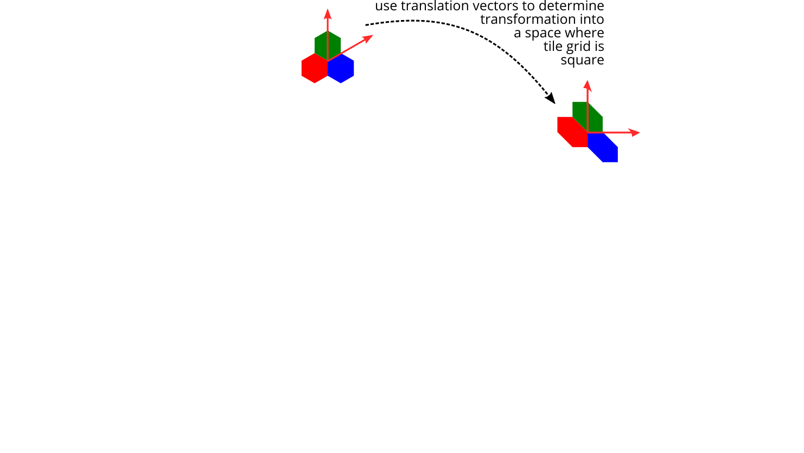
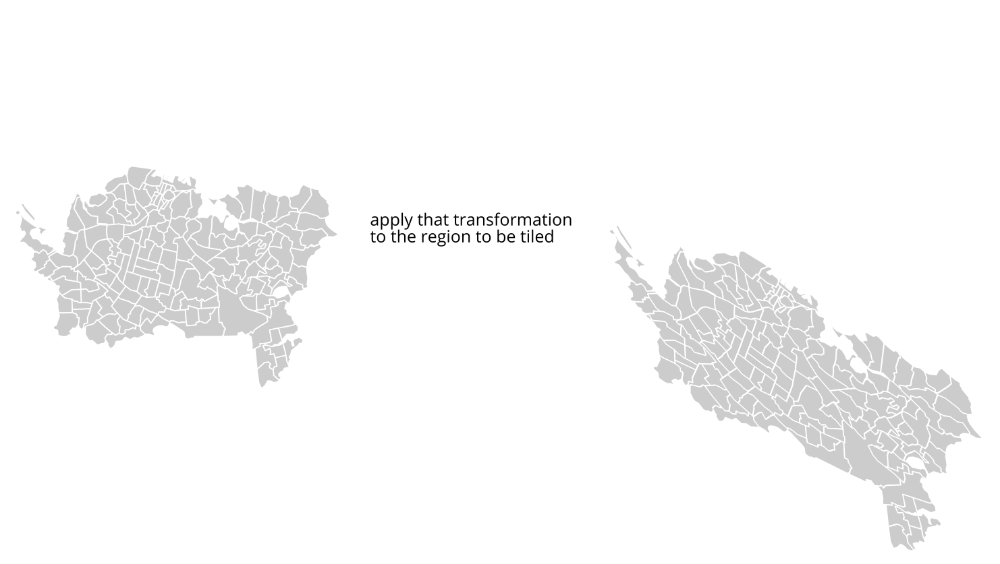
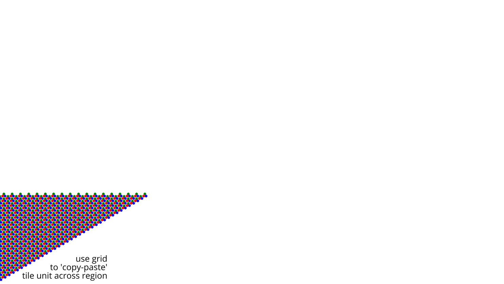

# Review {.smaller background-image="images/detailed-weave.png" background-opacity=0.5 style="text-shadow: 0px 0px 5px #fff;"}
The TL;DR;

## The idea

Two types of thematic map for complex multivariate data

Elements in a tiled pattern 'pick up' data from area units to allow combining multiple choropleths in a single map

<!-- ## The tiling process
::: {.r-stack}
{width="1482"}

{.fragment .fade-in fragment-index=1 width="1482"}

{.fragment .fade-in fragment-index=2 width="1482"}

{.fragment .fade-in fragment-index=3 width="1482"}

{.fragment .fade-in fragment-index=4 width="1482"}

{.fragment .fade-in fragment-index=5 width="1482"}
::: -->

## `weavingspace`
::: {.columns}
::: {.column width="55%"}
A python module available at [github.com/DOSull/weavingspace](https://github.com/DOSull/weavingspace)

Install it with

    > pip install weavingspace
:::
::: {.column width="45%"}

:::
:::

## Maps with just three lines of code!
```python
tile_unit = TileUnit(tiling_type = "laves", code = "4.8.8",
                     crs = ak.crs, spacing = 500)

tiling = Tiling(tile_unit, ak)

fig = (tiling.get_tiled_map(prioritise_tiles = True)
  .render(ids_to_map = ids, vars_to_map = vars, colors_to_use = cmaps,
          legend = False, figsize = (10, 7)))
```

&nbsp;

::: aside
Maps on the next slides are of the IMD. See: Exeter DJ, Zhao J, Crengle S, Lee A, Browne M, 2017, [The New Zealand Indices of Multiple Deprivation (IMD): A new suite of indicators for social and health research in Aotearoa, New Zealand](https://dx.plos.org/10.1371/journal.pone.0181260) _PLOS ONE_ **12**(8) e0181260
:::

## {data-background="images/ak-imd-4-8-8.png" data-background-size="contain"}

## {data-background="images/ak-imd-twill-ab-cd.png" data-background-size="contain"}


# MapWeaver web app

{fig-align="center"}

## Maps without code! {data-background="images/mapweaver-app.png" background-opacity=0.75 style="text-shadow: 0px 0px 5px #fff;"}

### [geospatialstuff.com/mapweaver/app](https://geospatialstuff.com/mapweaver/app){style="background:rgba(255,255,255,0.5);"}


# `weavingspace_qgis` plugin

{fig-align="center"}

## Better maps without code! {.smaller data-background="images/weavingspace-plugin-2.png" data-background-size="contain" background-opacity=0.75 style="text-shadow: 0px 0px 5px #fff;"}

### [github.com/FoldingSpace/weavingspaceQGIS/](https://github.com/FoldingSpace/weavingspaceQGIS){style="background:rgba(255,255,255,0.5);"}

## Live demo time! {data-background="images/Wile-E-Coyote-1.jpg.webp"}

## {style="text-align:center;"}
### Questions? {style="font-size:144px;"}
[github.com/DOSull/weavingspace](https://github.com/DOSull/weavingspace)

[geospatialstuff.com/mapweaver/app/](https://geospatialstuff.com/mapweaver/app/)

[github.com/FoldingSpace/weavingspaceQGIS/](https://github.com/FoldingSpace/weavingspaceQGIS)

And for more about my work in general: 

[geospatialstuff.com](https://geospatialstuff.com)